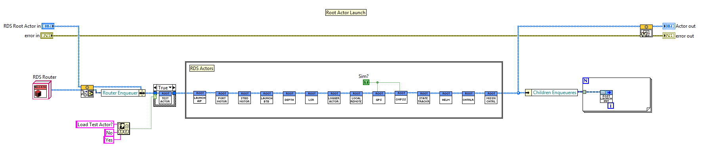
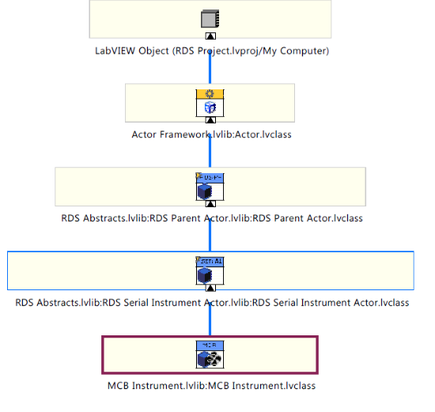

# RoboDolf Software

The RoboDolf was a robot boat designed to assign in acoustic dolphin research in
Belize. It was an unmanned surface vessel (USV) that was built on a 16' long
SeaCycle catamaran platform. It was powered by a LiFePo4 battery bank powering
two modified electric thrusters in a differential thrust configuration. It has
two communication radio systems, a long range 900 MHz radio for basic telemetry
and a 2.4GHz 802.11 link for a full data link. The vehicle could operate under
manned mode, with an operator on-board controlling the vehicle with an xbox
controller, under shore remote mode and under autonomous waypoint follow mode.
The vehicle had a host of instruments and sensors along with 4 actuated
instrument pods that could be automatically raised and lowered into the water.
The vehicle and field OPS systems where shipped to a remote atoll off the coast
of Belize and successfully operated in mangroves.

In this repo, the entire software system powering the RoboDolf is supplied. The
system was written by Paul Sammut in LabVIEW using the actor framework. A custom
message routing and subscription layer was written on top of the actor framework
that facilitated a one-to-many node communication system.

## RDS Architecture

The RDS system makes heavy use of LV-OOP and the Actor Framework. Each major
function of the RoboDolf is written as a nested child actor object that inherits
from a special RDS Parent Actor object. This allowed me to be able to create
node-like processes that ran independently of each other, but could easily share
data between each other in a structured way. 

RDS comprises the following actors:
- [AIP Actor](#aip-actor)
- [Port Motor Actor][1]
- [STBD Motor Actor][1]
- [Battery Manager Actor](#battery-manager-actor)
- [Dept Sensor Actor](#dept-sensor-actor)
- [LSR Actor](#lsr-actor)
- [HSR Actor](#hsr-actor)
- [Logger Actor](#logger-actor)
- [Local Remote Actor](#local-remote-actor)
- [GPS Actor](#gps-actor)
- [Compass Actor](#compass-actor)
- [State Tracker Actor](#state-tracker-actor)
- [Helm Actor](#helm-actor)
- [Controller Actor](#controller-actor)
- [Mission Control Actor](#mission-control-actor)

[1]: #mcb motor actor (port and stbd)

### AIP Actor

The Actuated Instrument Pod system is a set of 4 poles that can be deployed into
the water automatically by a linear actuator. The AIP actor is responsible for
the following:

- create and maintains a serial connection to the AIP system 
- subscribe and monitor to AIP-command messages
- subscribe and monitor water-depth messages and automatically raise the AIP if water-depth is below a minimum

### MCB Motor Actor (Port and STBD)

The Port Motor Actor is an instance of an MCB Instrument Class which inherits
from an RDS Instrument class. The RDS Instrument class is a descendant of the
RDS Parent Actor class, and adds serial communications functionality. This actor
can be set up to be a Port or STBD motor controller, which follows the DRY
principle for identical motor controller code. This actor is responsible for the 
following:

- create and maintain a serial connection to the specified motor controller (port/stbd)
- subscribe to motor messages and enact motor commands to appropriate serial commands
- read back state information about thruster, pack a motor state message and send it out

### Battery Manager Actor
