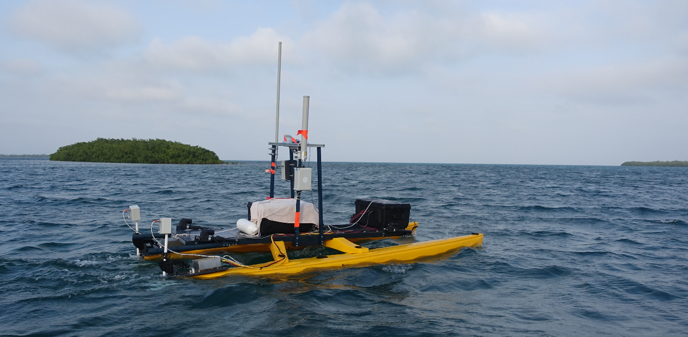
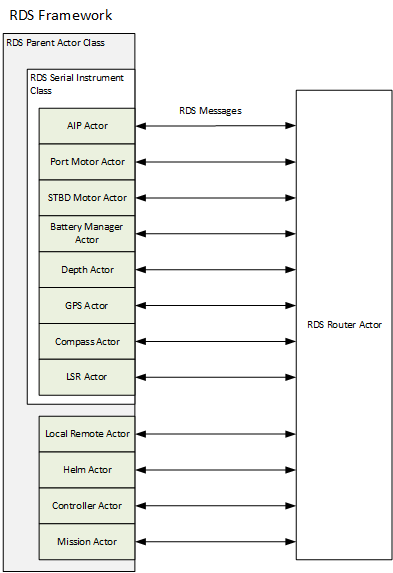
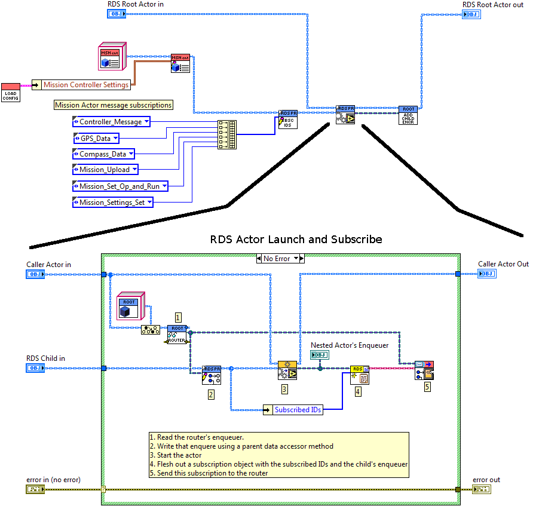
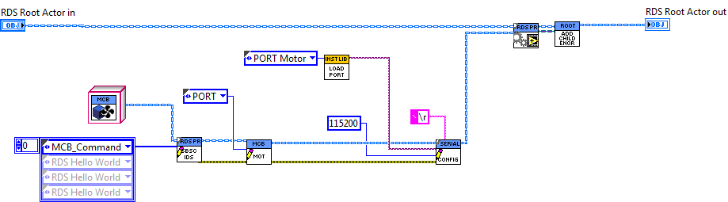
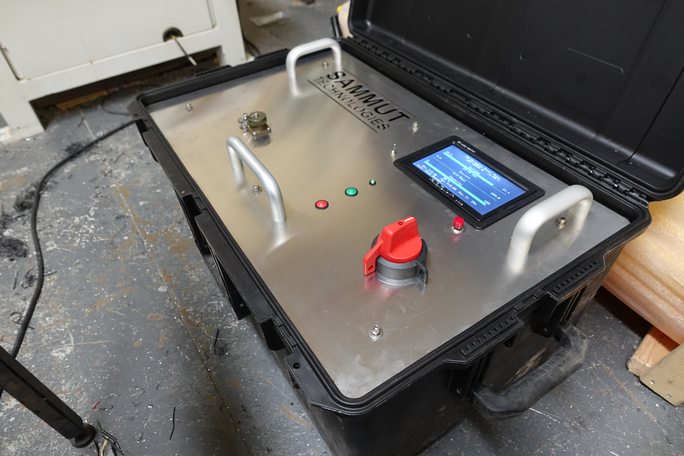
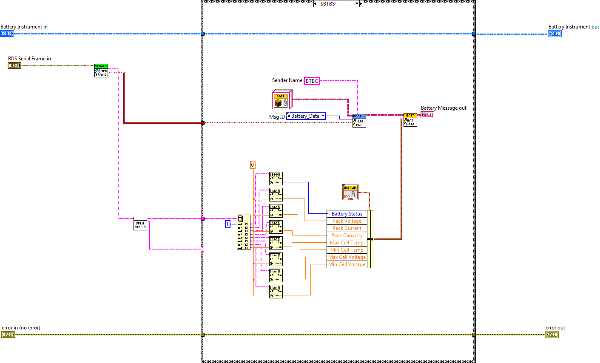
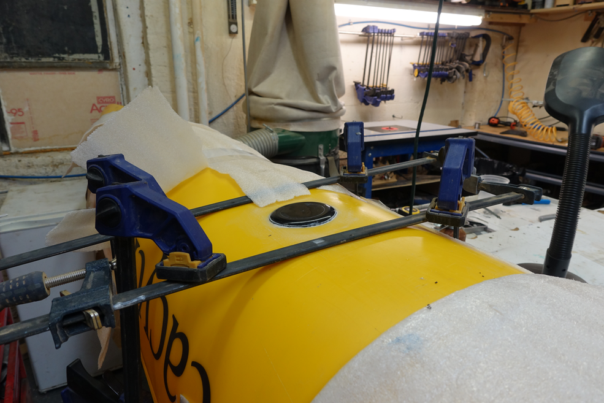
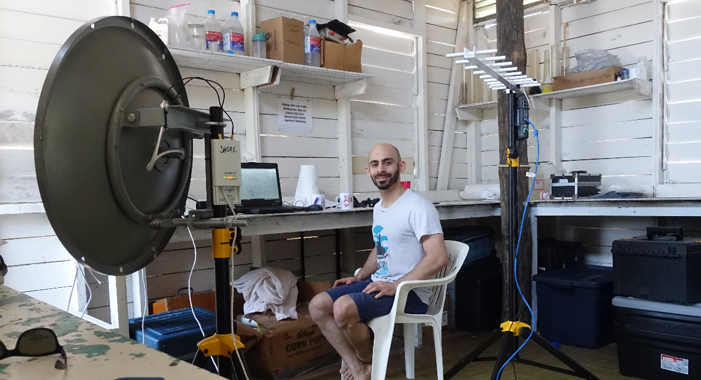
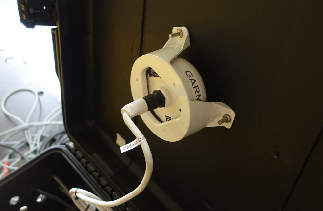
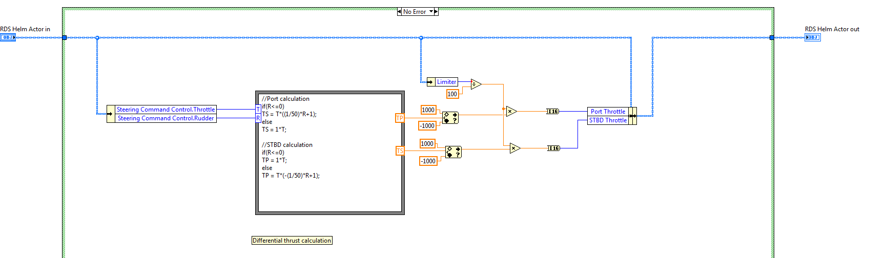

# RoboDolf Software (RDS)

The RoboDolf is an electric robot boat designed to conduct acoustic dolphin
research in Belize. Acoustic and visual recording of dolphins is conducted to
study dolphin vocalization gain insights into complex dolphin socialization.
A robotic boat platform that was silent and had minimal visual impact on natural
dolphin behavior was required, and drove the specifications for the RoboDolf.

The RoboDolf is an unmanned surface vessel (USV) that was built on a 16' long
SeaCycle catamaran platform. It has a LiFePo4 battery bank powering two modified
electric thrusters in a differential thrust configuration. It has two
communication radio systems, a long range 900 MHz radio for basic telemetry and
a 2.4GHz 802.11 link for a full data/video link. The vehicle can operate under 3
different modes. A manned mode with an operator on-board controlling the vehicle
with an xbox controller; under shore remote mode; and under autonomous mode.  The
vehicle has a host of instruments and sensors along with 4 actuated instrument
pods that can be automatically raised and lowered into the water.  The vehicle
and field OPS systems where shipped to a remote atoll off the coast of Belize
and where it successfully operated.

For a video of its construction and operation [click here](https://youtu.be/pHH6SKcS8ms).

In this repo, the software system powering the RoboDolf is supplied. The system
was written by Paul Sammut in LabVIEW using the Actor Framework and LV-OOP. A
custom message routing and subscription layer was written on top of the Actor
Framework that facilitated a one-to-many node communication system. A class
structure was created to facilitate the writing of common nodes, such as
controllers and serial instruments. This system is called the RDS Framework.

This project was made possible by the sponsor Dr. Marcelo Magnasco at the
Rockefeller University and Eric Angel Ramos who runs the dolphin research
programs in Belize.

***Quick Note: If coding anything like this, do it in ROS :)***

## RDS Framework Architecture

The RDS Framework makes heavy use of LV-OOP and the Actor Framework. Each major
function of the RoboDolf is written as a nested child actor object that inherits
from a special RDS Parent Actor class. This allowed for the creation of
node-like processes that run independently of each other, but can easily share
data between each other in a structured way. 

The system works on a one to many publisher/subscribers principle. Each actor
subscribes to a list of message types on launch. During run-time the actor can
send whatever messages it likes. Logic code can be written on receipt of the
messages, on an internal actor loop or by some other means such as on receipt
of hardware events.

This framework was written because the LabVIEW Actor Framework does not have
native functionality for one to many message broadcasting. Each actor must have
access to a queue handle for any actor it wants to send messages to. This was
overcome by creating an actor called the RDS Router, and by creating an RDS
Parent class that has functionality to subscribe to a list of messages; send
messages to the router; and receive messages from the router. In this way, each
actor only needs to have the queue handle of the RDS Router Actor, sending it
messages and not worrying about who needs to see them.  All messages are wrapped
in an RDS Message class which allows the RDS Router to handle them regardless of
their specific type implementation.

This framework allows for all common functionality to be shared across actors and
allowed one developer to be able to quickly code the robotic sub-systems.
Operational overhead was minimal and all inter-actor communications was handled
by performant LabVIEW queues, and implemented in the battle-tested LabVIEW Actor
Framework.

## RDS Actors

RDS comprises the following actors:

- [RDS Router Actor](#rds-router-actor)
- [AIP Actor](#aip-actor)
- [Port Motor Actor](#mcb-motor-actor-port-and-stbd)
- [STBD Motor Actor](#mcb-motor-actor-port-and-stbd)
- [Battery Manager Actor](#battery-manager-actor)
- [Depth Sensor Actor](#depth-sensor-actor)
- [LSR Actor](#lsr-actor)
- [Logger Actor](#logger-actor)
- [Local Remote Actor](#local-remote-actor)
- [GPS Actor](#gps-actor)
- [Compass Actor](#compass-actor)
- [State Tracker Actor](#state-tracker-actor)
- [Helm Actor](#helm-actor)
- [Controller Actor](#controller-actor)
- [Mission Control Actor](#mission-control-actor)

### RDS Router Actor

The RDS Router handles all inter-actor communications. It operates on a
principle of subscriptions. Each actor sends the RDS Router an array of messages
it is subscribed to. This subscription is implemented as a boolean array, with
the index corresponding to a unique id that addresses each message. This list of
unique message ID's is implemented as a typedef. This boolean array, along with
the actor's message queue is packed into an RDS Subscription object and sent to
the RDS Router. This functionality, which is common to all RDS actor's is
implemented in the RDS Parent Actor class which all RDS Actors inherit from. The
following image shows a specific RDS Actor, in this case the Mission Control
Actor, being configured with mission control settings and message subscriptions
and being "launched and subscribed". In the launch and subscribe phase the RDS
Actor is launched, given the handle of the RDS Router queue (so it can send it
RDS messages) and having its subscription list sent to the RDS router, so then
RDS Router knows what messages it wants to receive.

During run time, RDS Actors send messages to the RDS Router. The router receives
the messages, and through each subscription it has (one for every RDS Actor) and
checks to see if that actor is subscribed to that message ID. It does this by
simply indexing a boolean array, which takes O(1) time for each actor
subscription. If that boolean is true, it sends the message to the associated
message queue. Easy peasy!

### AIP Actor

The Actuated Instrument Pod (AIP) system is a set of 4 poles that can be
deployed into the water automatically by a linear actuator. It can monitor
deployed, deploying, stowed, and stowing states of each pod independently and
can also actuate each pod independently. The AIP actor is responsible for the
following:

- create and maintains a serial connection to the AIP system 
- subscribe and monitor to AIP-command messages
- subscribe and monitor water-depth messages and automatically raise the AIP if water-depth is below a minimum

#### Subscriptions and Publications

The AIP Actor subscribes to:

* AIP Command Message
* AIP Set Min Depth Message
* Depth Data Message

The AIP Actor publishes these RDS Messages:

* AIP Status Message

### MCB Motor Actor (Port and STBD)

The Port Motor Actor is an instance of an MCB Instrument Class which inherits
from an RDS Instrument class. The RDS Instrument class is a descendant of the
RDS Parent Actor class, and adds serial communications functionality. This actor
can be set up to be a Port or STBD motor controller, which follows the DRY
principle for identical motor controller code. The motor controller is an
MDC1230 RoboteQ single channel 80A brushed motor controller. 

This actor is responsible for the following:

- create and maintain a serial connection to the specified motor controller (port/STBD)
- subscribe to motor messages and enact motor commands to appropriate serial commands
- read back state information about thruster, pack a motor state message and send it out

#### Subscriptions and Publications

The MCB Motor Actor subscribes to:

* MCB Command Message 

The MCB Motor Actor publishes these RDS Messages:

* Motor Data Message

### Battery Manager Actor

The Battery Management Actor inherits from the RDS Instrument Class to gain
access to serial port functionality. It communicates with the Battery Box
computer and handles reading the state of the battery along with having the
ability to issue a battery kill command that disconnects the main power relay.
The battery bank is a set of 2 LiFePo4 12.8V 100Ah packs in parallel for a total
of 200Ah at 12V nominal.

#### Subscriptions and Publications

The Battery Manager Actor subscribes to:

* Battery Shutdown Message

The Battery Manager Actor publishes these RDS Messages:

* Battery State Message

### Depth Sensor Actor

The Depth Sensor Actor inherits from the RDS Instrument Class to gain access to
serial port functionality. It communicates through RS485 to a thru-hull depth
transducer and publishes water depth messages.

#### Subscriptions and Publications

The Depth Sensor Actor publishes this RDS Message:

* Depth Data Message

### LSR Actor

The Low Speed Radio (LSR) Actor handles duplex wireless communication to a
remote system via a wireless Digi 900 MHz link. It does this by subscribing to a
list of RDS messages. On receipt of any of these messages, it serializes them
into a string, then compresses the string using GZIP, splits the string into a
set of packets to satisfy the maximum COBS packet length less 2 bytes for a
CRC32 number, computes the CRC32 value and adds it to the end, then encodes it
in COBS to create a packet with a unique termination character. With this set of
uniquely terminated byte array packets, it sends them out to the LSR to be
transmitted wirelessly. 

The receiver receives and decodes these packets in the reverse manner. It then
converts the serialized RDS string into a valid RDS message object and simply
sends it to the RDS message router as if it were the original sender. The
receiver also has the same exact sending functionality, and can send packets to
the LSR actor on board the ship. The LSR Actor receives these packs and decodes
them in the same way. 

With this communications system, actors can communicate to each other
asynchronously while not running on the same computer, miles away from each
other thanks to the 900MHz link. The base station utilized a parabolic antenna,
while the RoboDolf had an omnidirectional antenna onboard.

#### Subscriptions and Publications

The LSR Actor subscribes to:

* State Sample Message

The LSR Actor publishes this RDS Message:

* Controller Message

### Logger Actor

The Logger Actor creates log files for post mission review. It does this by
simply recording RDS Message traffic. A Logger replay utility was also written
to playback the RDS messages. A list of RDS messages is used for logging
subscription.

#### Subscriptions and Publications

The Logger Actor subscribes to:

* State Sample Message

### Local Remote Actor

The Local Remote Actor handles the functionality that allows an onboard vehicle
operator to steer the boat via the onboard xbox controller. Because there are
multiple controllers (there is the shore remote, local remote and mission
controller) that can each steer the helm, the operator had to  first has to
press a button on the controller that requests control from the vehicle.  This
request is managed by the Controller Actor, which handles arbitration of who is
currently in control of the vehicle. 

The Local Remote Actor works by converting joystick commands into rudder and
throttle commands. These commands are called RDS Steering Commands and are read
by the Helm Actor. The Helm actor then converts the rudder and throttle commands
into throttle commands for the Port and STBD thrusters.

#### Subscriptions and Publications

The Local Remote Actor subscribes to:

* Controller Message

The Local Remote Actor publishes this RDS Messages:

* Controller Message

### GPS Actor

The GPS Actor handles the communication with the Garmin marine GPS. It is an RDS
Instrument Actor object and receives, decodes NMEA strings and packs them into
an RDS GPS message. This data is used by the Helm Actor for navigation and
waypoint reference.

#### Subscriptions and Publications

The GPS Actor publishes this RDS Messages:

* GPS Data Message

### Compass Actor

The Compass Actor interfaces with an OceanServer OS5000 digital compass which
fuses data from Honeywell magnetometer and ST Microelectronics accelerometers to
produce an AHRS output. 

#### Subscriptions and Publications

The Compass Actor publishes this RDS Messages:

* Compass Data Message

### State Tracker Actor

The State Tracker Actor monitors all the RoboDolf's various vital signs from the
different subsystems and compiles them into one RDS State object. This object
contains every sensor channel and subsystem state and is sampled at a set
sampling rate. For a list of all things sampled into an [RDS State object see
here](images/RDS_state.png). The State Tracker Actor sends this compiled RDS
State object at a set rate. This object is sent over the LSR and provides the
main telemetry feedback during shore monitoring and remote operation.

#### Subscriptions and Publications

The State Tracker Actor subscribes to:

* AIP Command Message
* AIP Set Min Depth Message
* AIP Status Message
* Battery Shutdown Message
* Battery Data Message
* Compass Data Message
* Controller Message
* Controller State Message
* Depth Data Message
* GPS Data Message
* Helm Heading Command Message
* Helm Limiter Set Message
* Helm Status Message
* Helm Steering Command Message
* MCB Command Message
* MCB State Message
* Mission Controller State Message
* Mission Set Op and Run Message
* Mission Settings Set Message
* Mission Upload Message
* PID Gains Set Message
* Set Mag Dev Message
* State Sample Message
* State Sample Request Message

The State Tracker Actor publishes these RDS Messages:

* State Sample Message
* State Sample Request Message

### Helm Actor

The Helm Actor is the process that issues throttle commands to the motors. It
does this in two ways, by reading heading commands (imagine the Captain saying
"Point the ship to 35 degrees" or by reading steering commands containing rudder
and throttle data (imagine the Captain saying "Right full rudder and all ahead
full"). The RoboDolf steers by use differential thrust. This has the mechanical
benefit of avoiding rudder actuators that add cost and reliability issues and
also allows for in-place turning. This actor operates by a state machine which
has three of the following states: 

* idle 
* executing steering command
* executing heading command

The state changes are triggered by incoming steering or heading messages. If the
Helm Actor receives a steering messages, it switches its state to "executing
steering command" and executes a set of code to process and enact the steering
command. Same goes for the heading command. This allow for clean and separated
code for each operating mode. The state machine also allows the Helm Actor to
operate under its own control loop asynchronously with respect to incoming
commands. The Helm Actor also implements a timeout mechanism for all steering
and heading commands and issues an All Stop command if no new steering/heading
commands are received.

When following steering commands the Helm Actor converts the rudder and throttle
commands into motor thrust commands using a differential thrust algorithm. When
following heading commands the Helm Actor uses a PID loop with the desired
heading as a setpoint and the actual heading as the input. The gains were
tweaked during field tests and can be set remotely and while under operation. 

#### Subscriptions and Publications

The Helm Actor subscribes to:

* GPS Data Message
* Compass Data Message
* PID Gains Set Message
* Helm Limiter Set Message
* Helm Heading Command Message
* Helm Steering Command Message

The Helm Actor publishes these RDS Messages:

* Helm Status Message
* MCB Command Message

### Controller Actor

The Controller Actor is responsible for arbitrating control of the ship. There
are three different controllers (think different officers on a ship) that can
have control of the ship depending on the running mode. This arbitration system
prevents controllers from fighting over control by issuing competing
steering/heading commands.

* local remote - an operator on board the vehicle using the Xbox controller
* shore remote - an operator on shore using an Xbox controller remotely
* mission control - the Mission Control Actor running the mission and steering the ship to the next waypoint.

The arbitration works by a control request/relinquish/grant mechanism. Whenever
a controller wants to take control, it issues a request to the Controller Actor.
The Controller Actor then relinquishes the command of any currently enabled
controller and then grants control to the requesting controller. The Helm Actor
only enacts steering messages coming from controllers that have a control
boolean enabled.

#### Subscriptions and Publications

The Controller Actor subscribes to:

* Controller Message

The Controller Actor publishes these RDS Messages:

* Controller Message
* Controller State Message

### Mission Control Actor

The Mission Control Actor's job is to run a mission script and give heading and
speed commands to the Helm Actor. A mission script is an array of MissionOp 
objects that the Mission Control Actor sequences through. There are 4 types of
MissionOps:

* Waypoint
* Loiter
* Wait
* Deploy AIP
* Stow AIP

The Mission Controller has a state machine that monitors its state along with
incoming commands. It can receive mission upload messages during runtime and
commands to run a loaded mission at a desired operation index. When running in
waypoint mode, the Mission Controller calculates the distance and heading using
the Haversine formula and generates a heading and distance vector. It then
issues heading-throttle commands to the Helm and the Helm keeps the ship on the
vector. When the ship gets within the waypoint radius, the sequencer moves on to
the next waypoint.

#### Subscriptions and Sends

The Mission Controller subscribes to:

* Compass Data Message
* Controller Message
* GPS Data Message
* Mission Controller Cycle Message
* Mission Controller Send State Message
* Mission Set Op and Run Message
* Mission Settings Set Message
* Mission Upload Message

The Mission Controller publishes these RDS Messages:

* Mission Controller Cycle Message
* Mission Controller State Message
* Mission Set Op Index and Run Message
* Mission Upload Message
* Set Mission Controller Settings Message

## Utilities

### Shore Remote

The Shore Remote utility allows for full monitoring and control of a deployed
RoboDolf from a shore laptop connected to a Digi 900 MHz radio. It is written as
its own project and makes use of the RDS Framework library. This GUI makes use
of LabVIEW's native chart displays for which it is well suited.

### Log Reader

The Log Reader utility loads log files and can display all the run data.

## Dependencies

RDS was written in LabVIEW 2015.

RDS uses OpenG LabVIEW ZIP Library 4.0.0-2 and above.  This package is used to
compress the serialized object data transported wirelessly over the LSR.  JKI
VIPM Link - vipm://oglib_lvzip?repo_url=http://www.jkisoft.com/packages.
