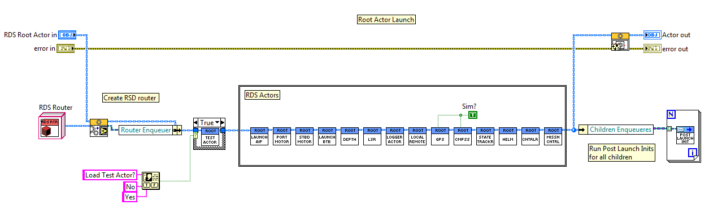
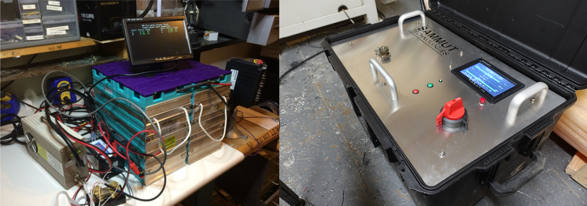
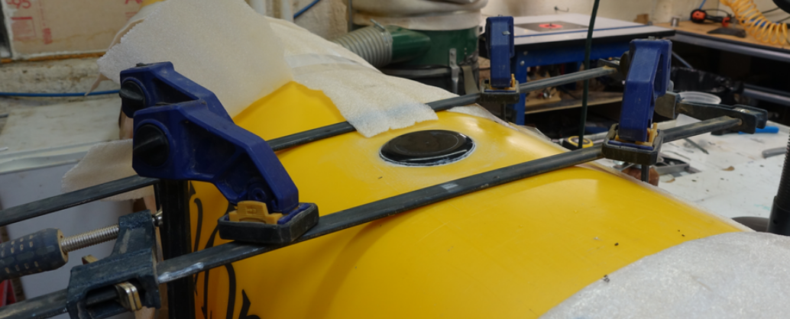
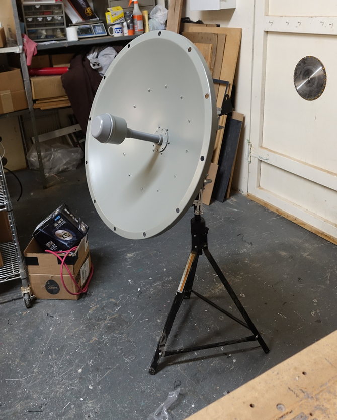
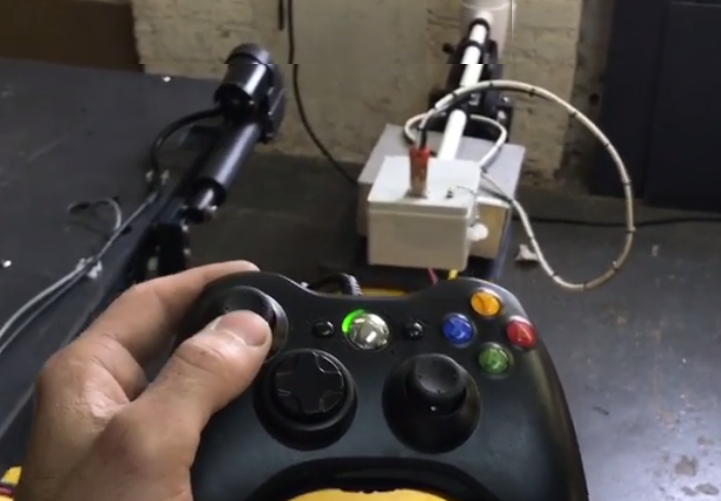

# RoboDolf Software

The RoboDolf is a robot boat designed to assign in acoustic dolphin research in
Belize. It was an unmanned surface vessel (USV) that was built on a 16' long
SeaCycle catamaran platform. It was powered by a LiFePo4 battery bank powering
two modified electric thrusters in a differential thrust configuration. It has
two communication radio systems, a long range 900 MHz radio for basic telemetry
and a 2.4GHz 802.11 link for a full data link. The vehicle could operate under
manned mode, with an operator on-board controlling the vehicle with an xbox
controller, under shore remote mode and under autonomous waypoint follow mode.
The vehicle had a host of instruments and sensors along with 4 actuated
instrument pods that could be automatically raised and lowered into the water.
The vehicle and field OPS systems where shipped to a remote atoll off the coast
of Belize and successfully operated in mangroves.

In this repo, the entire software system powering the RoboDolf is supplied. The
system was written by Paul Sammut in LabVIEW using the actor framework. A custom
message routing and subscription layer was written on top of the actor framework
that facilitated a one-to-many node communication system. Note: I wrote this
project before learning ROS and if were doing it again I would write it in ROS.

## RDS Architecture

The RDS system makes heavy use of LV-OOP and the Actor Framework. Each major
function of the RoboDolf is written as a nested child actor object that inherits
from a special RDS Parent Actor object. This allowed me to be able to create
node-like processes that ran independently of each other, but could easily share
data between each other in a structured way. 

RDS comprises the following actors:

- [AIP Actor](#aip-actor)
- [Port Motor Actor](#mcb-motor-actor-port-and-stbd)
- [STBD Motor Actor](#mcb-motor-actor-port-and-stbd)
- [Battery Manager Actor](#battery-manager-actor)
- [Dept Sensor Actor](#dept-sensor-actor)
- [LSR Actor](#lsr-actor)
- [Logger Actor](#logger-actor)
- [Local Remote Actor](#local-remote-actor)
- [GPS Actor](#gps-actor)
- [Compass Actor](#compass-actor)
- [State Tracker Actor](#state-tracker-actor)
- [Helm Actor](#helm-actor)
- [Controller Actor](#controller-actor)
- [Mission Control Actor](#mission-control-actor)

### AIP Actor

The Actuated Instrument Pod (AIP) system is a set of 4 poles that can be
deployed into the water automatically by a linear actuator. It can monitor
deployed, deploying, stowed, and stowing states of each pod independently and
can also actuate each pod independently. The AIP actor is responsible for the
following:

- create and maintains a serial connection to the AIP system 
- subscribe and monitor to AIP-command messages
- subscribe and monitor water-depth messages and automatically raise the AIP if water-depth is below a minimum

### MCB Motor Actor (Port and STBD)

The Port Motor Actor is an instance of an MCB Instrument Class which inherits
from an RDS Instrument class. The RDS Instrument class is a descendant of the
RDS Parent Actor class, and adds serial communications functionality. This actor
can be set up to be a Port or STBD motor controller, which follows the DRY
principle for identical motor controller code. 

This actor is responsible for the following:

- create and maintain a serial connection to the specified motor controller (port/STBD)
- subscribe to motor messages and enact motor commands to appropriate serial commands
- read back state information about thruster, pack a motor state message and send it out

### Battery Manager Actor

The Battery Management Actor inherits from the RDS Instrument Class to gain
access to serial port functionality. It communicates with the Battery Box
computer and handles reading the state of the battery along with having the
ability to issue a battery kill command that disconnects the main power relay.
The battery bank is a set of 2 LiFePo4 12.8V 100Ah packs in parallel for a total
of 200Ah at 12V nominal.

### Depth Sensor Actor

The Depth Sensor Actor inherits from the RDS Instrument Class to gain access to
serial port functionality. It communicates through RS485 to a thru-hull depth
transducer and publishes water depth messages.

### LSR Actor

The Low Speed Radio (LSR) Actor handles duplex wireless communication to a remote
system via a wireless 900 MHz link. It does this by subscribing to a list of RDS
messages. On receipt of any of these messages, it serializes them into a string,
then compresses the string using GZIP, splits the string into a set of packets
to satisfy the maximum COBS packet length less 2 bytes for a CRC32 number,
computes the CRC32 value and adds it to the end, then encodes it in COBS to
create a packet with a unique termination character. With this set of uniquely
terminated byte array packets, it sends them out to the LSR to be transmitted
wirelessly. 

The receiver receives and decodes these packets in the reverse manner. It then
converts the serialized RDS string into a valid RDS message object and simply
sends it to the RDS message router as if it were the original sender. The
receiver also has the same exact sending functionality, and can send packets to
the LSR actor on board the ship. The LSR Actor receives these packs and decodes
them in the same way. 

With this communications system, actors can communicate to each other
asynchronously while not running on the same computer, miles away from each
other thanks to the 900MHz link. The base station utilized a parabolic antenna,
while the RoboDolf had an omnidirectional antenna onboard.

### Logger Actor

The Logger Actor creates log files for post mission review. It does this by
simply recording RDS Message traffic. A Logger replay utility was also written
to playback the RDS messages. A list of RDS messages is used for logging
subscription.

### Local Remote Actor

The Local Remote Actor handles the functionality that allows an onboard vehicle
operator to steer the boat via the onboard xbox controller. Because there are
multiple controllers (there is the shore remote, local remote and mission
controller) that can each steer the helm, the operator had to  first has to
press a button on the controller that requests control from the vehicle.  This
request is managed by the Controller Actor, which handles arbitration of who is
currently in control of the vehicle. 

The Local Remote Actor works by converting joystick commands into rudder and
throttle commands. These commands are called RDS Steering Commands and are read
by the Helm Actor. The Helm actor then converts the rudder and throttle commands
into throttle commands for the Port and STBD thrusters.

### GPS Actor

The GPS Actor handles the communication with the Garmin marine GPS. It is an RDS
Instrument Actor object and receives, decodes NMEA strings and packs them into
an RDS GPS message. This data is used by the Helm Actor for navigation and
waypoint reference.

### Compass Actor

The Compass Actor interfaces with an OceanServer OS5000 digital compass which
fuses data from Honeywell magnetometer and ST Microelectronics accelerometers to
produce an AHRS output. 

### State Tracker Actor

The State Tracker Actor monitors all the RoboDolf's various vital signs from the
different subsystems and compiles them into one RDS State object. This object
contains every sensor channel and subsystem state and is sampled at a set
sampling rate. For a list of all things sampled into an [RDS State object see
here](images/RDS_state.png). The State Tracker Actor sends this compiled RDS
State object at a set rate. This object is sent over the LSR and provides the
main telemetry feedback during shore monitoring and remote operation.

### Helm Actor

The Helm Actor is the process that issues throttle commands to the motors. It
does this in two ways, by reading heading commands (imagine the Captain saying
"Point the ship to 35 degrees" or by reading steering commands containing rudder
and throttle data (imagine the Captain saying "Right full rudder and all ahead
full"). The RoboDolf steers by use differential thrust. This has the mechanical
benefit of avoiding rudder actuators that add cost and reliability issues and
also allows for in-place turning. This actor operates by a state machine which
has three of the following states: 

* idle 
* executing steering command
* executing heading command

The state changes are triggered by incoming steering or heading messages. If the
Helm Actor receives a steering messages, it switches its state to "executing
steering command" and executes a set of code to process and enact the steering
command. Same goes for the heading command. This allow for clean and separated
code for each operating mode. The state machine also allows the Helm Actor to
operate under its own control loop asynchronously with respect to incoming
commands. The Helm Actor also implements a timeout mechanism for all steering
and heading commands and issues an All Stop command if no new steering/heading
commands are received.

When following steering commands the Helm Actor converts the rudder and throttle
commands into motor thrust commands using a differential thrust algorithm. When
following heading commands the Helm Actor uses a PID loop with the desired
heading as a setpoint and the actual heading as the input. The gains were
tweaked during field tests and can be set remotely and while under operation. 

### Controller Actor

The Controller Actor is responsible for arbitrating control of the ship. There
are three different "officers" that can have control of the ship. This
arbitration system prevents controllers from fighting over control by issuing
competing steering/heading commands.

* local remote - an operator on board the vehicle using the Xbox controller
* shore remote - an operator on shore using an Xbox controller remotely
* mission control - the Mission Control Actor running the mission and steering the ship to the next waypoint.

The arbitration works by a control request/relinquish/grant mechanism. Whenever
a controller wants to take control, it issues a request to the Controller Actor.
The Controller Actor then relinquishes the command of any currently enabled
controller and then grants control to the requesting controller. The Helm Actor
only enacts steering messages coming from controllers that have a control
boolean enabled.

### Mission Control Actor

The Mission Control Actor's job is to run a mission script and give heading and
speed commands to the Helm Actor. A mission script is an array of MissionOp 
objects that the Mission Control Actor sequences through. There are 4 types of
MissionOps:

* Waypoint
* Loiter
* Wait
* Deploy AIP
* Stow AIP

The Mission Controller has a state machine that monitors its state along with
incoming commands. It can receive mission upload messages during runtime and
commands to run a loaded mission at a desired operation index. When running in
waypoint mode, the Mission Controller calculates the distance and heading using
the Haversine formula and generates a heading and distance vector. It then
issues heading-throttle commands to the Helm and the Helm keeps the ship on the
vector. When the ship gets within the waypoint radius, the sequencer moves on to
the next waypoint.

The Mission Controller subscribes to:

* Controller Message
* Mission Upload Message
* Mission Set Op and Run Message
* Mission Settings Set Message
* GPS Data Message
* Compass Data Message
* Mission Controller Cycle Message
* Mission Controller Send State Message

The Mission Controller publishes these RDS Messages:

* Mission Controller State Message
* Mission Set Op Index and Run Message
* Mission Upload Message
* Set Mission Controller Settings Message
* Mission Controller Cycle Message

## Utilities

### Monitor

### Log Reader
